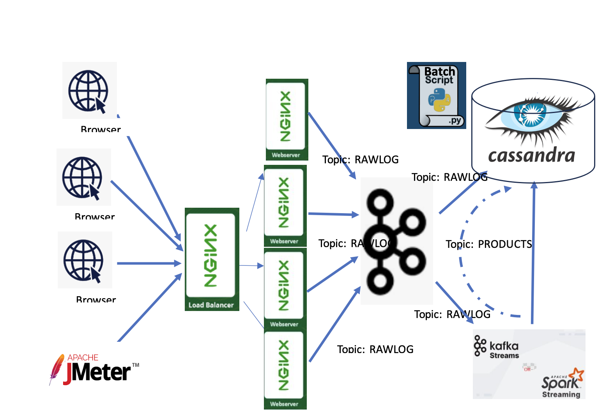

> Name: Nikhitha Guntaka
>
> Course: SENG 691 Special Topics in Software Engineering
>
> Final Project
>
> <u>Real-time & batch access log</u> <u>processing</u>

Table of Contents:

**Table** **of**
**Contents:.......................................................................................................................**
**2** **Project**
**Team................................................................................................................................**
**3** Parts of the
project...................................................................................................................3
**Project**
**Definition.........................................................................................................................3**
Key
Concepts.....................................................................................................................3
**Project**
**Design:............................................................................................................................**
**4** **Project**
**Implementation:..............................................................................................................4**
Step 1: Set Up the Web Server
Cluster...................................................................................4

> 1\. Install Web
> Servers:.......................................................................................................4
> 2. Nginx configuration
> (docker-compose.yml.....................................................................4
> HTTP Load
> Balancer:........................................................................................................
> 6 Log
> Forwarding:.................................................................................................................6
>
> Step 2: Install and Configure
> Kafka.........................................................................................7 1.
> Install
> Kafka:..................................................................................................................
> 7 Start Zookeeper and Kafka brokers in the
> docker............................................................. 8
> Create Kafka
> Topics:..........................................................................................................8
> Set Up Kafka
> Producers:...................................................................................................
> 8 Python code to input Nginx Logs to Kafka Topic for every 5
> seconds...............................9 Configure Kafka consumers'
> fan-out
> mode........................................................................9
> Step 3: Configure
> Cassandra..................................................................................................
> 9 1. Install
> Cassandra:..........................................................................................................9
> Set Up
> Tables:..................................................................................................................10
> Step 4: Interesting Logs into Cassandra from Kafka
> Topic....................................................10 1. Kafka
> Consumer 1 (Raw Logs to
> Cassandra):............................................................
> 10
>
> 2\. Kafka Consumer 2 (Real-Time
> Aggregation):..............................................................11
> Step 5: Batch
> Processing.......................................................................................................11
> The batch program that processes the table LOG and produces the N most
> visited pages:.11

**Implementation**
**Limitations:.....................................................................................................11**
**Project** **demo** **and**
**codebase:....................................................................................................12**
**References:................................................................................................................................12**

Project Team

Worked alone, No Teammates.

All aspects of the project are contributed by Nikhitha Guntaka.

Parts of the project

> 1 configuring Nginx Web servers (3)
>
> 2 Configuring the Nginx Load balancer
>
> 3 Collecting logs from Nginx in JSON Format
>
> 4 Configuring Kafka and Zookeper
>
> 5 Creating Kafka topic and loading Nginx logs into the Kafka topic.
> Configure consumer pool fan out mode
>
> 6 Configure Cassandra in docker
>
> 7 Running Batch script to fetch all the logs from Kafka topic into
> Cassandra db (Log Table)
>
> 8 Fetch live Kafka stream using Kafka streaming and upload the results
> into the cassandra Results Table

Project Definition

The project involves designing and implementing a scalable data pipeline
for processing web server access logs in batch and real-time. The
objective is to calculate the most observed logs in real-time and batch
mode over a configurable period. To provide fault tolerance,
scalability, and efficiency, the system combines several technologies,
including Kafka, Cassandra, and a cluster of replicated web servers.

**Key** **Concepts**

> 1\. **Web** **Server** **Cluster:** Replicated servers with a load
> balancer for high availability; logs forwarded to Kafka.
>
> 2\. **Load** **Balancer:** Distributes traffic to prevent overload. 3.
> **Kafka:** Handles log streaming with:
>
> ○ **Consumer** **1:** Stores raw logs in Cassandra.
>
> ○ **Consumer** **2:** Aggregates top N pages every P minutes.

> 4\. **Cassandra:** NoSQL database storing raw logs and aggregated
> results.
>
> 5\. **Real-Time** **Processing:** Aggregates visits and
> stores/displays results instantly. 6. **Batch** **Processing:**
> Computes daily top N pages and archives in Cassandra. 7.
> **Scalability:** Distributed components ensure reliability and traffic
> handling.

Project Design:

Project Implementation:

This implementation is broken down into specific components, below is
the step-by-step implementation.

Step 1: Set Up the Web Server Cluster

> 1\. Install Web Servers:
>
> ○ Installed multiple instances of NGINX on the docker (Nginx for
> Windows, n.d.) ○ Configure them to serve static pages (/product1,
> /product2, etc.).
>
> 2\. Nginx configuration (docker-compose.yml
>
> Unset
>
> version: '3.8'
>
> services:
>
> \# Nginx Load Balancer load_balancer:
>
> image: nginx:latest
>
> container_name: nginx_load_balancer volumes:
>
> \- ./nginx-load-balancer.conf:/etc/nginx/nginx.conf ports:
>
> \- "80:80" depends_on:
>
> \- web1 - web2 - web3
>
> \# Web Server 1 web1:
>
> image: nginx:latest container_name: nginx_web1 volumes:
>
> \- ./web1:/usr/share/nginx/html \# Mount custom content for server
> expose:
>
> \- "80" \# Internal port for load balancer communication
>
> \# Web Server 2 web2:
>
> image: nginx:latest container_name: nginx_web2 volumes:
>
> \- ./web2:/usr/share/nginx/html expose:
>
> \- "80"
>
> \# Web Server 3 web3:
>
> image: nginx:latest container_name: nginx_web3 volumes:
>
> \- ./web3:/usr/share/nginx/html
>
> expose: - "80"

HTTP Load Balancer:

> ● Install and configure **Nginx** **Load** **Balancer** to distribute
> requests across the web servers.(*Best* *Option* *to* *Put* *Nginx*
> *Logs* *Into* *Kafka?*, n.d.)
>
> ● Example load balancer configuration (nginx-load-balancer.conf)
>
> Unset events {}
>
> http {
>
> upstream backend { server web1:80; server web2:80; server web3:80;
>
> }
>
> server { listen 80;
>
> location / {
>
> proxy_pass http://backend; proxy_set_header Host \$host;
> proxy_set_header X-Real-IP \$remote_addr;
>
> proxy_set_header X-Forwarded-For \$proxy_add_x_forwarded_for; }
>
> } }

Log Forwarding:

Configure the web servers to write access logs and forward them directly
to Kafka in JSON format .(*Tech* *Blog:* *How* *to* *Configure* *JSON*
*Logging* *in* *Nginx?* *-* *Velebit* *AI*, n.d.)

log configuration in nginx-load-balancer.conf:

> Unset
>
> http {
>
> log_format json_combined escape=json
>
> '{ "remote_addr": "\$remote_addr", ' '"time_local": "\$time_local", '
> '"request": "\$request", ' '"status": "\$status", '
>
> '"body_bytes_sent": "\$body_bytes_sent", ' '"http_referer":
> "\$http_referer", ' '"http_user_agent": "\$http_user_agent" }';
>
> access_log /var/log/nginx/access.log json_combined;
>
> server { listen 80;
>
> location / {
>
> root /usr/share/nginx/html; index index.html;
>
> } }
>
> }

Step 2: Install and Configure Kafka

> 1\. Install Kafka:
>
> ○ Configure Kafka and Zookeeper in the docker
> (kafka-docker-compose.yaml)
>
> Unset
>
> version: '3.8' services:
>
> zookeeper:
>
> image: confluentinc/cp-zookeeper:latest container_name: zookeeper
>
> environment: ZOOKEEPER_CLIENT_PORT: 2181 ZOOKEEPER_TICK_TIME: 2000
>
> kafka:
>
> image: confluentinc/cp-kafka:latest container_name: kafka
>
> ports:
>
> \- "9092:9092" environment:
>
> KAFKA_ZOOKEEPER_CONNECT: zookeeper:2181 KAFKA_ADVERTISED_LISTENERS:
> PLAINTEXT://localhost:9092 KAFKA_OFFSETS_TOPIC_REPLICATION_FACTOR: 1
>
> Start Zookeeper and Kafka brokers in the docker
>
> Unset
>
> docker-compose -f kafka-docker-compose.yml up -d

Create Kafka Topics:

> ● Create two topics: RAWLOG and PRODUCTS.
>
> Unset
>
> kafka-topics.sh --create --topic RAWLOGS --bootstrap-server
> localhost:9092 --partitions 3 --replication-factor 1
>
> kafka-topics.sh --create --topic PRODUCTS --bootstrap-server
> localhost:9092 --partitions 3 --replication-factor 1

Set Up Kafka Producers:

> ● Configure web servers to send logs to Kafka using a producer script.
> Example Python Kafka producer:
>
> Unset
>
> kafka-console-producer.sh --topic RAWLOGS --bootstrap-server
> localhost:9092

Python code to input Nginx Logs to Kafka Topic for every 5 seconds

> Python
>
> Input access logs from nginx load balancer docker container to kafka
> topic "RAWLOGS"
>
> Can access the code
> [<u>here</u>](https://drive.google.com/file/d/1aqSvmPVD79z5Vnu60WjI5_S3_RzTQJUP/view?usp=sharing)
> [<u>https://drive.google.com/file/d/1aqSvmPVD79z5Vnu60WjI5_S3_RzTQJUP/view?usp=shar</u>](https://drive.google.com/file/d/1aqSvmPVD79z5Vnu60WjI5_S3_RzTQJUP/view?usp=sharing)
> [<u>ing</u>](https://drive.google.com/file/d/1aqSvmPVD79z5Vnu60WjI5_S3_RzTQJUP/view?usp=sharing)

Configure Kafka consumers' fan-out mode

> Python
>
> Consumer fan out mode can acces the code
> [<u>here</u>](https://drive.google.com/file/d/1tSm4upG9con6joLEjJmpnzs_r3EesVK5/view?usp=sharing)
>
> [<u>https://drive.google.com/file/d/1tSm4upG9con6joLEjJmpnzs_r3EesVK5/view?usp=shar</u>](https://drive.google.com/file/d/1tSm4upG9con6joLEjJmpnzs_r3EesVK5/view?usp=sharing)
> [<u>ing</u>](https://drive.google.com/file/d/1tSm4upG9con6joLEjJmpnzs_r3EesVK5/view?usp=sharing)

Step 3: Configure Cassandra

> 1\. Install Cassandra:
>
> ○ Configure Cassandra in the docker
>
> Unset
>
> version: '3.8'
>
> services: cassandra:
>
> image: cassandra:latest container_name: cassandra ports:
>
> \- "9042:9042" \# Expose Cassandra Query Language (CQL) port
> environment:
>
> \- CASSANDRA_CLUSTER_NAME=MyCluster
>
> \- CASSANDRA_NUM_TOKENS=256 - CASSANDRA_START_RPC=true
>
> volumes:
>
> \- cassandra_data:/var/lib/cassandra \# Persistent storage for
> Cassandra data
>
> networks:
>
> \- cassandra_network
>
> networks: cassandra_network:
>
> driver: bridge
>
> volumes: cassandra_data:

Set Up Tables:

> ● Create namespace and tables inside Cassandra:
>
> Name-space **:** browesrlogs **,** Table: rawlogs
>
> Unset
>
> Python code used to create namespace and insert logs into Cassnadra
> can acces the code
> [<u>here</u>](https://drive.google.com/file/d/1VsSS0VwbTvVfcfEq6AN1_QJU4AQXKxly/view?usp=sharing)
>
> [<u>https://drive.google.com/file/d/1VsSS0VwbTvVfcfEq6AN1_QJU4AQXKxly/view?usp=shar</u>](https://drive.google.com/file/d/1VsSS0VwbTvVfcfEq6AN1_QJU4AQXKxly/view?usp=sharing)
> [<u>ing</u>](https://drive.google.com/file/d/1VsSS0VwbTvVfcfEq6AN1_QJU4AQXKxly/view?usp=sharing)

Step 4: Interesting Logs into Cassandra from Kafka Topic

> 1\. Kafka Consumer 1 (Raw Logs to Cassandra): ○ Write raw logs to
> Cassandra.(John, 2021)
>
> Unset
>
> [<u>https://drive.google.com/file/d/1VsSS0VwbTvVfcfEq6AN1_QJU4AQXKxly/view?usp=shar</u>](https://drive.google.com/file/d/1VsSS0VwbTvVfcfEq6AN1_QJU4AQXKxly/view?usp=sharing)
> [<u>ing</u>](https://drive.google.com/file/d/1VsSS0VwbTvVfcfEq6AN1_QJU4AQXKxly/view?usp=sharing)

2\. Kafka Consumer 2 (Real-Time Aggregation):

> ● Process logs for real-time aggregation
>
> Unset
>
> Real time streaming using Kafka Streaming.
>
> Took the logs from Kafka Consumer from topic "RAWLOGS" and perform
> some aggregation and summary operation.
>
> can acces the code
> [<u>here</u>](https://drive.google.com/file/d/1Nc1jQGQt9MeT9-BVkn73Y4mVOcIwYlWi/view?usp=sharing)
>
> [<u>https://drive.google.com/file/d/1Nc1jQGQt9MeT9-BVkn73Y4mVOcIwYlWi/view?usp=shar</u>](https://drive.google.com/file/d/1Nc1jQGQt9MeT9-BVkn73Y4mVOcIwYlWi/view?usp=sharing)
> [<u>ing</u>](https://drive.google.com/file/d/1Nc1jQGQt9MeT9-BVkn73Y4mVOcIwYlWi/view?usp=sharing)

Step 5: Batch Processing

Batch program that processes the table LOG and produces the N most
visited pages :

> Unset
>
> code to perform batch procressing can be seen
> [<u>here</u>](https://drive.google.com/file/d/1bx9YD3uaMuBRoMgqX2iz4U4eVW7oWj6j/view?usp=sharing)
> [<u>https://drive.google.com/file/d/1bx9YD3uaMuBRoMgqX2iz4U4eVW7oWj6j/view?usp=shar</u>](https://drive.google.com/file/d/1bx9YD3uaMuBRoMgqX2iz4U4eVW7oWj6j/view?usp=sharing)
> [<u>ing</u>](https://drive.google.com/file/d/1bx9YD3uaMuBRoMgqX2iz4U4eVW7oWj6j/view?usp=sharing)

Implementation Limitations:

> 1\. Potential storage constraints in Cassandra due to indefinite
> retention of raw logs.
>
> 2\. Managing distributed clusters (Kafka, Cassandra, web servers)
> increases complexity. 3. Risk of data loss in Kafka if replication is
> not properly configured.
>
> 4\. Consumer failures may disrupt data ingestion or processing. 5.
> Complexity in end-to-end testing of the entire pipeline

Project demo and codebase:

[<u>Final Project Video Demonstration</u>](https://youtu.be/dE1TS0UAGBM)

You Tube Link
[<u>-https://youtu.be/dE1TS0UAGBM</u>](https://youtu.be/dE1TS0UAGBM)
Google Drive Link :

[<u>https://drive.google.com/file/d/16Gy3R4CPa7a3WpmgmG120CBVVthijewC/view?usp=sharing</u>](https://drive.google.com/file/d/16Gy3R4CPa7a3WpmgmG120CBVVthijewC/view?usp=sharing)

References:

1.*nginx* *for* *Windows*. (n.d.).
[<u>https://nginx.org/en/docs/windows.html</u>](https://nginx.org/en/docs/windows.html)

2\. *Tech* *Blog:* *How* *to* *configure* *JSON* *logging* *in* *nginx?*
*-* *Velebit* *AI*. (n.d.). Velebit AI.
[<u>https://www.velebit.ai/blog/nginx-json-logging/</u>](https://www.velebit.ai/blog/nginx-json-logging/)

3.*best* *option* *to* *put* *Nginx* *logs* *into* *Kafka?* (n.d.).
Stack Overflow.
[<u>https://stackoverflow.com/questions/25452369/best-option-to-put-nginx-logs-into-kafka</u>](https://stackoverflow.com/questions/25452369/best-option-to-put-nginx-logs-into-kafka)
4. John, J. (2021, June 21). *Getting* *started* *with* *Kafka*
*Cassandra* *Connector*. digitalis.io.

[<u>https://digitalis.io/blog/apache-cassandra/getting-started-with-kafka-cassandra-connecto</u>](https://digitalis.io/blog/apache-cassandra/getting-started-with-kafka-cassandra-connector/)
[<u>r/</u>](https://digitalis.io/blog/apache-cassandra/getting-started-with-kafka-cassandra-connector/)

5\. *Send* *real* *time* *continuous* *log* *data* *to* *kafka* *and*
*consume* *it*. (n.d.). Stack Overflow.
[<u>https://stackoverflow.com/questions/60483120/send-real-time-continuous-log-data-to-ka</u>](https://stackoverflow.com/questions/60483120/send-real-time-continuous-log-data-to-kafka-and-consume-it)
[<u>fka-and-consume-it</u>](https://stackoverflow.com/questions/60483120/send-real-time-continuous-log-data-to-kafka-and-consume-it)
